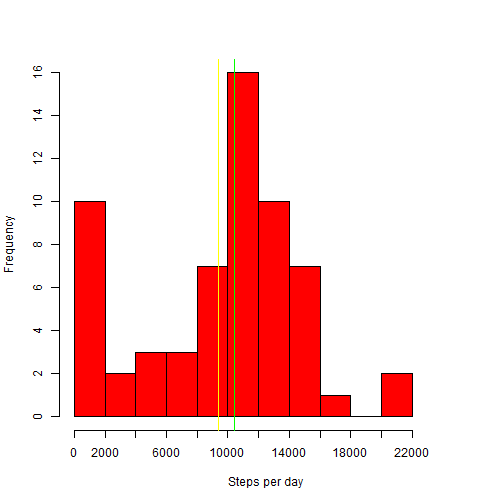
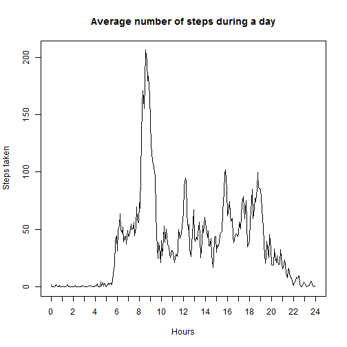
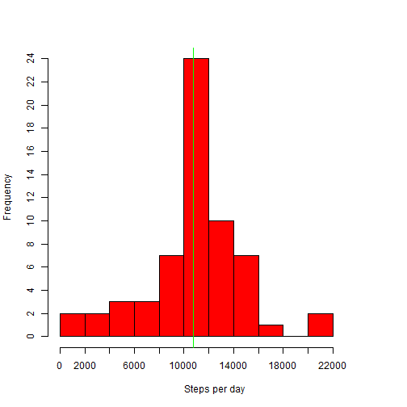
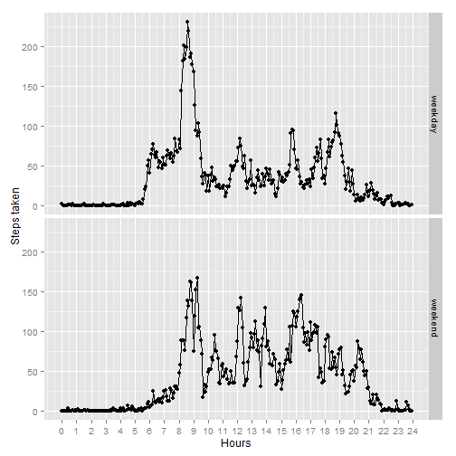

File *activity.csv* was obtained from URL https://d396qusza40orc.cloudfront.net/repdata%2Fdata%2Factivity.zip
Download and unzip the file.

*Necessary packages*

```r
library("dplyr")
library("ggplot2")
```

##Loading and preprocessing the data
To reproduce my results you have top set working directory. It should contain file activity.csv obtained from the URL above. I use D:\Eugene\R\RR. Please make necessary adjustments.

```r
setwd("D:/Eugene/R/RR")
activity <- read.csv("activity.csv")
#converting second column to Date
activity[,2] <- as.Date(activity[,2])
# making interval more descriptive
activity[,3] <- paste(substr(sprintf("%00004d",activity[,3]),1,2),':',substr(sprintf("%00004d",activity[,3]),3,4),sep="")
# help column - minutes from midnight
activity[,4] <- strtoi(substr(activity[,3],1,2),base=10)*60 + strtoi(substr(activity[,3],4,5),base=10)
names(activity)[4] <- "minutes"
```


##What is mean total number of steps taken per day?

Let us calculate the total number of steps taken per day

```r
total_steps <- activity %>%
group_by(date) %>%
summarize(total_steps = sum(steps, na.rm=TRUE))
total_steps
```

```
## Source: local data frame [61 x 2]
## 
##          date total_steps
## 1  2012-10-01           0
## 2  2012-10-02         126
## 3  2012-10-03       11352
## 4  2012-10-04       12116
## 5  2012-10-05       13294
## 6  2012-10-06       15420
## 7  2012-10-07       11015
## 8  2012-10-08           0
## 9  2012-10-09       12811
## 10 2012-10-10        9900
## ..        ...         ...
```

Now let us draw a histogram of the total number of steps taken each day.

```r
# We should make vector from dataframe column
steps_hist <- total_steps[['total_steps']]
# Now the histogram
hist(steps_hist, right=FALSE, breaks=seq(0,22000,by=2000), xlim=c(0,25000),xlab="Steps per day", main="", col="red", xaxt='n', yaxt='n')
axis(side=1, at=seq(0,22000,2000),labels=seq(0,22000,2000))
axis(side=2, at=seq(0,16,2),labels=seq(0,16,2))
abline(v=mean(steps_hist), col="yellow")
abline(v=median(steps_hist), col="green")
```

 

Mean value is marked yellow and the median is green.

Let us calculate the mean and the median of the total number of steps taken per day.

```r
mean(steps_hist)
```

```
## [1] 9354.23
```

```r
median(steps_hist)
```

```
## [1] 10395
```

##What is the average daily activity pattern?
Here is a time series plot of the 5-minute interval (x-axis) and the average number of steps taken, averaged across all days (y-axis).

```r
mean_steps <- activity %>%
group_by(minutes) %>%
summarize(mean_steps = mean(steps, na.rm=TRUE))
plot(mean_steps,type="l", main="Average number of steps during a day", ylab="Steps taken", xlab="Hours", xlim=c(0,1440),xaxt="n")
axis(side=1, at=seq(0,1440,60),labels=seq(0,24,1))
```

 

Let us determine 5-minute interval, on average across all the days in the dataset, containing the maximum number of steps.

```r
mean_steps_sorted <- arrange(mean_steps,desc(mean_steps)) 
paste(mean_steps_sorted[1,1] %/% 60,"hours",mean_steps_sorted[1,1] %% 60,"minutes -",round(mean_steps_sorted[1,2],2),"steps")
```

```
## [1] "8 hours 35 minutes - 206.17 steps"
```
As we can see, the interval containig maximum number of steps is 515 minutes from midnight, which corresponds to 8:35 - 8:40

##Imputing missing values

There are plenty of missing values in the dataset.

```r
NA_values_count <- length(activity[is.na(activity[,1]),1])
NA_values_count
```

```
## [1] 2304
```

Now we need to fill in missing data (NA). Let us suppose that all days are almost equal. When there is no data for the interval, the rounded mean value for the same interval through all days will be used.
Let us create a new dataset that is equal to the original dataset but with the missing data filled in.

```r
activity_processed <- activity

#mean_steps is shorter and will be reused
#merge would be much safer
activity_processed[,5] <- round(mean_steps[,2])

#now we replace missing values with averages
activity_processed[is.na(activity_processed[,1]),1] <- activity_processed[is.na(activity_processed[,1]),5]

#and drop the last column - do not need it anymore
activity_processed <- activity_processed[-5]

#now will redo the same steps as before
total_steps_processed <- activity_processed %>%
group_by(date) %>%
summarize(total_steps = sum(steps, na.rm=TRUE))
```

Here is a histogram of the total number of steps taken each day with the missing data replaced.

```r
steps_hist_processed <- total_steps_processed[['total_steps']]
hist(steps_hist_processed, right=FALSE, breaks=seq(0,22000,by=2000), xlim=c(0,25000),xlab="Steps per day", main="", col="red", xaxt='n', yaxt='n')
axis(side=1, at=seq(0,22000,2000),labels=seq(0,22000,2000))
axis(side=2, at=seq(0,24,2),labels=seq(0,24,2))
abline(v=mean(steps_hist_processed), col="yellow")
abline(v=median(steps_hist_processed), col="green")
```

 

```r
mean(steps_hist_processed)
```

```
## [1] 10765.64
```

```r
median(steps_hist_processed)
```

```
## [1] 10762
```
Mean and median are almost the same now and both have grown. As we can see, imputing missing data had some impact on our average. Some zeroes became positive numbers, and average numbers grew.
Even more impact we can see at the histogram. The bucket 12000-14000 now contains 24 days!

##Are there differences in activity patterns between weekdays and weekends?

Let us create a new factor variable in the dataset with two levels – “weekday” and “weekend” indicating whether a given date is a weekday or weekend day.

```r
activity_processed[format(activity_processed[,2], "%u") %in% c(6, 7),5] <- 'weekend'
activity_processed[format(activity_processed[,2], "%u") %in% 1:5,5] <- 'weekday'
names(activity_processed)[5] <- "type"
```

Here is a panel plot containing a time series plot (i.e. type = "l") of the 5-minute interval (x-axis) and the average number of steps taken, averaged across all weekday days or weekend days (y-axis).

```r
mean_steps_week <- activity_processed %>%
group_by(type, minutes) %>%
summarize(mean_steps = mean(steps, na.rm=TRUE))
m<-qplot(x=minutes,y=mean_steps,data=mean_steps_week,xlim=c(0,1440), facets=type~.,ylab="Steps taken",xlab="Hours")
m<-m + scale_x_continuous(breaks=seq(0,1440,60),labels=seq(0,24,1))+geom_line(colour="black",size=0)
```

```
## Scale for 'x' is already present. Adding another scale for 'x', which will replace the existing scale.
```

```r
print(m)
```

 

As we can see, patterns are slightly different.On weekdays there is considerably more steps at the morning (when all go to their working places) and considerably less at the late evening. Looks like men stroll more at weekends.
